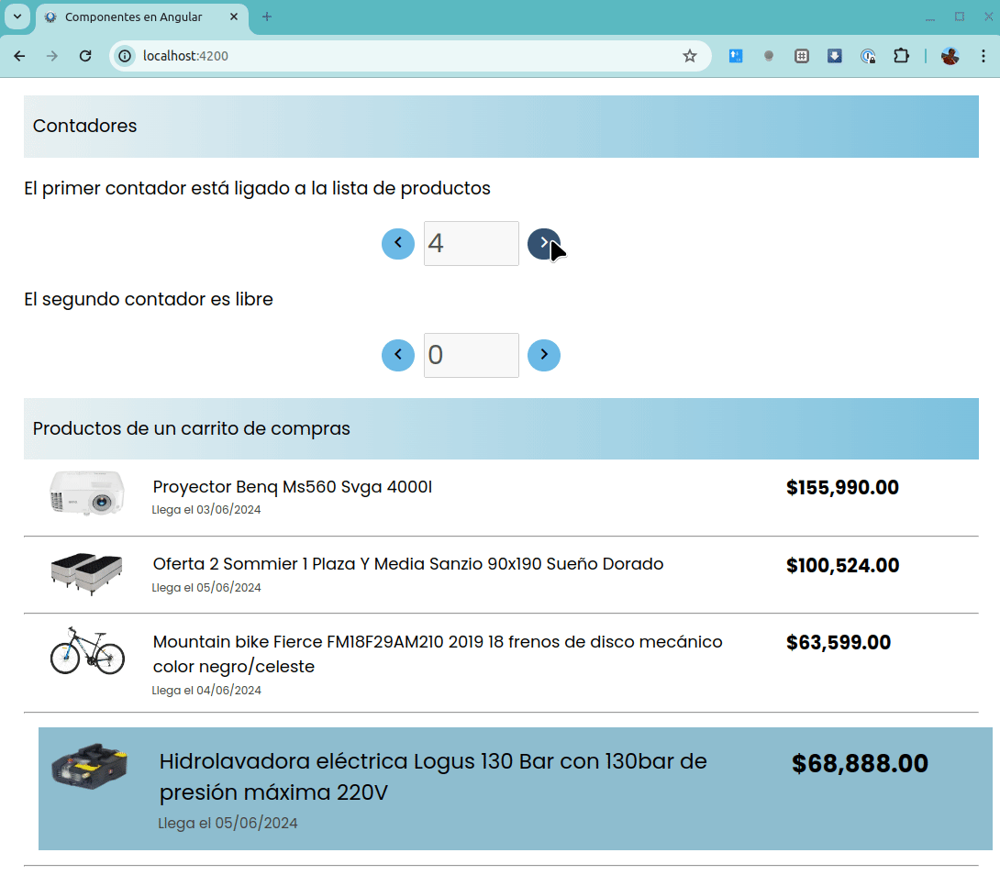
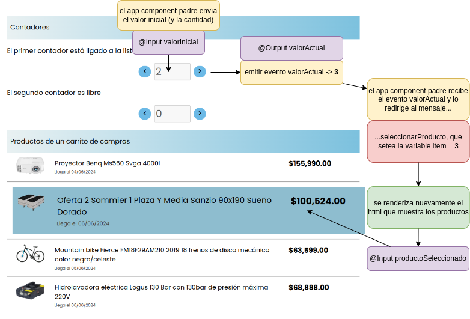

# Componentes reutilizables de Angular

[](https://github.com/uqbar-project/eg-componentes-angular/actions/workflows/build.yml) [](https://codecov.io/gh/uqbar-project/eg-componentes-angular)



## Creación de componentes con Angular CLI

Generamos dos componentes con la interfaz de línea de comandos de Angular

```bash
ng generate component contador # o ng g c contador
ng generate component producto
```

## Componente contador

### Llamando al contador desde app

El contador es un ejemplo simple, pero muestra 

- por un lado, la independencia del scope de variables de los componentes de Angular
- cómo nos llega y cómo enviamos información desde el componente

En la vista principal de la aplicación, definimos dos contadores, cada uno con diferente valor inicial. En el archivo app.component.html escribimos:

```html
<div>
  <app-contador [valorInicial]="item" [cantidad]="productos.length" ...>
  <app-contador [valorInicial]="0"></app-contador>
</div>
```

Fíjense que hay una diferencia entre:

```html
[valorInicial]="0"
```

donde el valor inicial que pasamos es la expresión 3 vs.

```html
valorInicial="0"
```

donde 0 se interpreta como un valor fijo, un String. Para poder enviar expresiones como parámetro es importante encerrar el parámetro `valorInicial` entre corchetes.

En el componente vamos a recibir como @Input 
- el valor inicial
- opcionalmente, una cantidad

Pero además, vamos a trabajar con un objeto de dominio contador, al que vamos a poder sumar o restarle un número (`contador.domain.ts`). En el caso de recibir una cantidad, lo que vamos a hacer es movernos de 1 a la cantidad de elementos: por ejemplo, si tenemos la cantidad 4 y el valor inicial 2, podemos subir de 2 a 3, de 3 a 4 y luego de 4 iremos a 1. De la misma manera al restar un valor, vamos de 2 a 1, de 1 a 4 y así sucesivamente. Si no ingresamos cantidad el contador sube o baja siempre un número.

> El contador como objeto de dominio tiene sus propios tests unitarios, que no dependen de la tecnología que utilicemos.

En el constructor definimos parámetros con el modificador `public` o `private` para generar un atributo en la misma clase:

```ts
export class Contador {
  constructor(public valor = 0, public cantidad = 0) { }
```

- primero definimos un atributo valor de tipo number, con valor por defecto 0
- por otra parte al construir un Contador, asignamos el valor recibido en el constructor en dicho atributo

Entonces:

```ts
new Contador()      // ==> el atributo valor se inicializa en 0, y la cantidad en 0
new Contador(5)     // ==> el atributo valor se inicializa en 5, y la cantidad en 0
new Contador(5, 7)  // ==> el atributo valor se inicializa en 5, y la cantidad en 7
```

Para más información pueden ver [este artículo](https://kendaleiv.com/typescript-constructor-assignment-public-and-private-keywords/).

### Modelo de la vista Contador

```ts
export class ContadorComponent {
  @Input() valorInicial!: number
  @Input() cantidad: number = 0

  ...

  contador!: Contador

  ngOnInit() {
    this.contador = new Contador(this.valorInicial, this.cantidad)
  }
```

¿Qué significa el signo de admiración (`!`) para la referencia contador? Que Typescript puede asumir que la variable siempre tendrá un valor Contador (no puede ser nula), en caso contrario cuando accedamos a dicha variable en runtime y sea nula recibiremos un mensaje de error (para más información recomendamos leer [este artículo](https://stackoverflow.com/questions/66843040/what-is-the-equivalent-of-late-lazy-lateinit-in-typescript)).

Así se construye el contador que va a ser el modelo de la vista. Aquí tendremos:

- _buttons_ que disparan actualizaciones al modelo (ver la propiedad _click_)...
- ...y un binding del modelo a la vista del input que muestra el valor actual del contador (deshabilitado para el usuario, ver la propiedad _value_ que utiliza el _moustache_ contador.valor)

Esto lo vemos en la vista contador.component.html:

```html
<div class="contador__form">
    <button class="circle color-primary" data-testid="restar" (click)="restar()">
        <i class="material-icons">keyboard_arrow_left</i>
    </button>
    <input class="contador__label" data-testid="contador" disabled value={{contador.valor}}/>
    <button class="circle color-primary" data-testid="sumar" (click)="sumar()">
        <i class="material-icons">keyboard_arrow_right</i>
    </button>
</div>
```

Algunas observaciones:

1. pueden coexistir dos componentes app-contador, cada una con su propio valor en el modelo
2. ¿por qué existe un método restar() y otro sumar() en el modelo de la vista? Porque queremos avisar a nuestro componente llamador (al padre) que cambiamos de estado. Eso nos va a permitir en nuestro caso seleccionar el siguiente producto de la lista.

### Evento de actualización al subir o bajar

Veamos cómo se implementa el método sumar() del componente contador:

```ts
sumar() {
  this.contador.sumar()
  this.valorActual.emit(this.contador.valor)
}
```

1. delegamos al contador la actualización interna del contador
2. por otra parte emitimos un evento de actualización, pasando el nuevo valor del contador. `valorActual` se definió como @Output en el mismo componente:

```ts
export class ContadorComponent {
  ...

  @Output() valorActual = new EventEmitter<number>()
```

Lo que debemos respetar es el tipo del valor _generic_ que espera el EventEmitter. Como el valor del contador es un número, tenemos que tiparlo como `EventEmitter<number>`.

Luego, en el componente App vamos a definir un método que escuche el evento y lo almacene dentro del estado del modelo de la vista de AppComponent:

```html
<app-contador [valorInicial]="item" [cantidad]="productos.length" (valorActual)="seleccionarProducto($event)"></app-contador>
```

El nombre `(valorActual)` debe coincidir con el `@Output` que definió el componente hijo, y el nombre del método que escucha el evento debe coincidir con este método que recibe como parámetro el nuevo valor. Sin embargo, en la vista nosotros escribimos `$event` que luego es traducido a un parámetro de tipo number dentro del AppComponent:

```ts
seleccionarProducto(nuevoItem: number) {
  this.item = nuevoItem
}
```

Vemos el gráfico general de la solución en Angular:



## Componente producto

El componente principal (app) genera un _loop for_ para mostrar todos los productos:

```html
@for (producto of productos; track producto; let i = $index) {
  <app-producto [producto]="producto" [productoElegido]="item - 1 === i"></app-producto>
  <hr/>
}
```

El componente producto recibe como inputs
- cada uno de los productos
- y nos dice si es el producto seleccionado: esto se da por el evento que emite el componente hermano **Contador**, que a su vez hace que el padre asigne en la variable item un número que representa el índice de la lista. Recordemos que en typescript trabajamos de 0 a _n - 1_, entonces tenemos que ajustar el ítem elegido con la posición que ocupa en la lista (siempre un número menos)

Ya dentro del componente producto, no necesitamos más que mostrar la información de cada producto. Las imágenes las sacamos del directorio `assets`, podríamos utilizar paths externos pero sirve como ejemplo didáctico.

## Testing

### Contador

Además de los mencionados tests unitarios para el contador, en los tests de la vista validamos

- que se pueda pasar un valor inicial como parámetro @input: se debe visualizar en el input de texto
- pasar un valor e incrementar uno el contador: se debe visualizar el nuevo valor en el input
- pasar un valor y la cantidad e incrementar sucesivamente el contador hasta volver su valor a 1
- pasar un valor y decrementar uno el contador: se debe visualizar el nuevo valor en el input
- pasar un valor y la cantidad y decrementar sucesivamente el contador hasta que el valor del contador sea la cantidad

Esto naturalmente está en el archivo _contador.component.spec.ts_, veamos un ejemplo:

```typescript
describe('counter - limit', () => {
  beforeEach(() => {
    fixture = TestBed.createComponent(ContadorComponent)
    component = fixture.componentInstance
    component.valorInicial = 2
    component.cantidad = 4
    fixture.detectChanges()
  })

  it('initial value should increase if plus button clicked, up to limit', () => {
    getByTestId(fixture, 'sumar').click()
    fixture.detectChanges()
    expect(getByTestId(fixture, 'contador').value).toEqual('3')
    getByTestId(fixture, 'sumar').click()
    getByTestId(fixture, 'sumar').click()
    fixture.detectChanges()
    expect(getByTestId(fixture, 'contador').value).toEqual('1')
  })
```

Para poder construir el objeto Contador y pasarle el valor inicial, debemos enviar el mensaje `fixture.detectChanges()` del componente. Por eso ésto lo hacemos en el beforeEach del test.

Si se fijaron bien, estamos utilizando la técnica de tener tags de HTML con atributos `data-testid`, para luego poder identificarlos puntualmente en los tests. Los navegadores ignoran esta directiva, lo que permite que nuestros tests sean resilientes a los cambios. La función `getByTestId` está definida en un archivo auxiliar llamado  `test-utils`.

La explicación completa la podés ver en [este video de Youtube](https://youtu.be/WIQvggovnY4).

## Componente padre

Por último, el componente padre también tiene su propio conjunto de tests, aunque al delegar principalmente a los componentes hijos, no son pruebas interesantes para contar (simplemente que se pueda crear correctamente).
